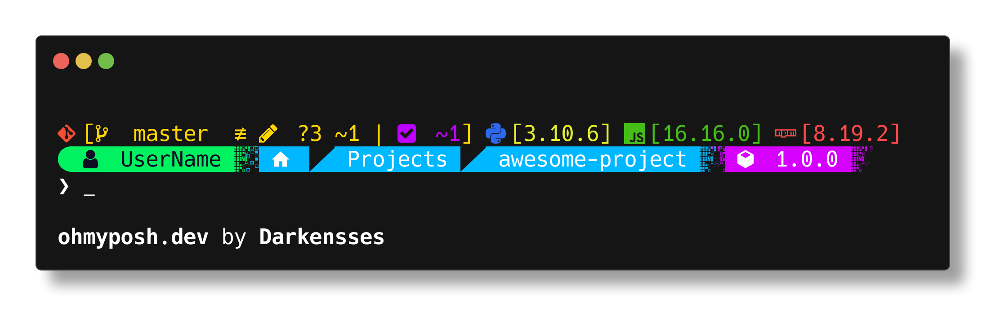
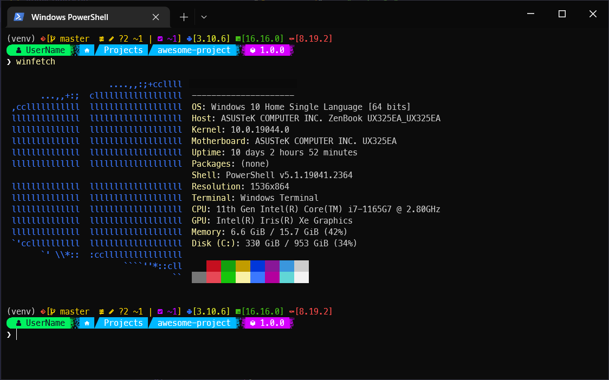

### Cybershell

Cybershell is a custom theme for oh-my-posh that tries to provoke a very pleasant and ✨ A E S T H E T I C ✨ feeling to every powershell user whenever use the terminal.

 
It also provides nice info for:
- :octocat: Git
- :snake: Python (virtualenv)
- :eight_spoked_asterisk: nodeJS
- 📦 npm
- :closed_book: package.json

### Inspiration
To pick the colors, shapes and structure of the theme I saw the whole oh-my-posh themes gallery and cyberpunk edge runner.

**Please support [oh-my-posh](https://github.com/jandedobbeleer/oh-my-posh) by clicking the star button! :star:**

### Example

Jasiel Guillen. 2022
